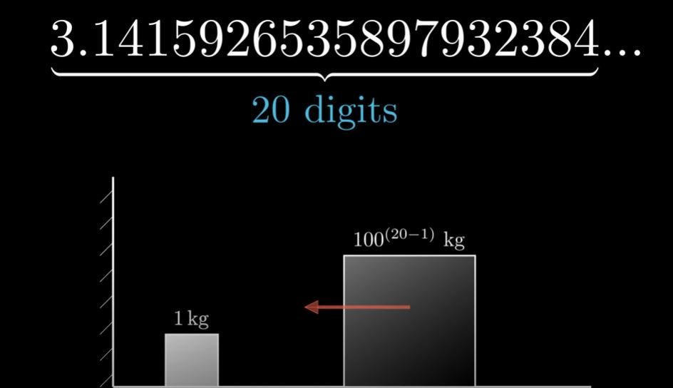
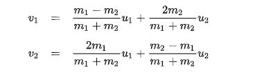

# Pi Block Collision 

this is a code which was inspired by 3blue1browns video "The most unexpected answer to a counting puzzle" which includes two sliding blocks with one going towards the smaller one 
which starts off stationary. Therere is a wall behind the small block which will allow the it to keep bouncing and until its velocity is smaller than the bigger block when it 
redirects it assuming that the blocks are purely elastic. This means that there are no energy lost during collision and sliding is frictionless.

https://www.youtube.com/watch?v=HEfHFsfGXjs&t

### How it works and what it does
in the video, he explains different methods in how to prove this but in code, I decided that making a program with the formula for elastic collision and just counting all the 
times it collides with another block or the wall can also work...

### version 1.0
-the code doesn't allow anything past 10 digits
